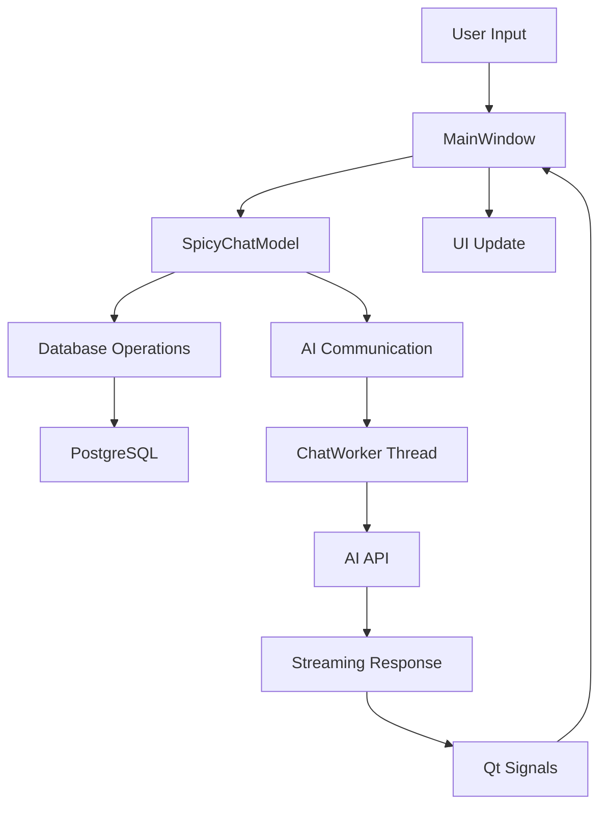
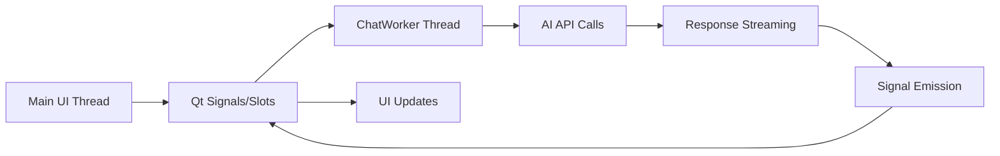

# SpicyChat Desktop GUI

## Description

A desktop GUI application for SpicyChat, an emotion-driven adult AI companion platform. This PySide6-based application provides the same functionality as the existing web interface, allowing users to chat with AI characters through a native desktop experience. The application connects to the existing PostgreSQL database and AI services, maintaining compatibility with the web version while offering a dedicated desktop interface.

## Functionality

### Core Features

- Character selection from database-stored AI personalities
- AI model selection with support for multiple LLM providers
- Real-time chat interface with streaming AI responses
- Persistent chat history across sessions
- Session management with user identification
- Chat history clearing functionality
- Asynchronous AI communication to maintain UI responsiveness

### User Interface

The interface consists of a main window with three primary sections:

```
+----------------------------------------------------------+
| SpicyChat Desktop                                    [_][□][X] |
+----------------------------------------------------------+
| Characters        | Chat Area                    | Models  |
| +---------------+ | +-------------------------+ | +-----+ |
| | □ Fujiwara    | | | AI: Hello! How are you? | | |QWen | |
| | □ Luna        | | | User: I'm doing well    | | |Llama| |
| | □ Takahashi   | | | AI: That's great to...  | | |GPT-4| |
| | □ Misaki      | | | [streaming response...] | | +-----+ |
| +---------------+ | +-------------------------+ |         |
|                   | | Type your message...    | [Send]  |
|                   | +-------------------------+         |
|                   | [Clear History]                     |
+----------------------------------------------------------+
```

**Layout Components:**
- **Left Panel:** Character list (QListWidget) displaying available AI characters
- **Center Panel:** Chat display area (QTextEdit) showing conversation history and message input (QLineEdit with Send button)
- **Right Panel:** AI model selection (QComboBox) and control buttons
- **Bottom Panel:** Message input area with send and clear history buttons

### Behavior Specifications

**Character Selection:**
- Click on character name to start/switch conversation
- Each character maintains separate chat history
- Character selection loads personality settings from database

**Message Flow:**
- User types message and clicks Send or presses Enter
- Message appears immediately in chat display
- AI response streams word-by-word as it's generated
- Both messages are saved to database upon completion

**Model Selection:**
- Dropdown shows available AI models ordered by priority
- Model change applies to current conversation
- Default model used if none selected

**History Management:**
- Chat history loads automatically when selecting character
- Clear History button removes all messages for current character
- History persists across application restarts

## Technical Implementation

### Architecture

The application follows a clear Model-View-Controller pattern with separation between GUI and business logic:

**gui/main.py (View/Controller):**
- PySide6 MainWindow with Fusion style and Auto color scheme
- UI component management and event handling
- Signal/slot connections for user interactions
- Threading coordination for AI communication
- Real-time UI updates for streaming responses

**gui/model.py (Business Logic):**
- Integration with existing app.api.bs database functions
- AI communication using app.api.ai.AI class
- Session and user management
- Chat room creation and management
- Message persistence and retrieval
- Error handling and recovery

### Data Structures

**Character Object:**
```python
{
    "id": "character_id",
    "name": "Character Name", 
    "settings": "Detailed personality instructions and behavior guidelines"
}
```

**AI Model Object:**
```python
{
    "id": 1,
    "name": "QWen 2.5 1m 14b",
    "model": "qwen2.5:14b",
    "api": "http://localhost:11434",
    "api_key": None,
    "extra_args": {"temperature": 0.7},
    "ordinal": 10
}
```

**Message Object:**
```python
{
    "id": 123,
    "room_id": 456,
    "from_id": "user_id_or_character_id",
    "from_bot": False,  # True for AI messages
    "content": "Message text content",
    "content_type": "text",
    "created_at": "2025-01-14T10:30:00Z",
    "send_to": "user"
}
```

### Algorithms

**Chat Processing Algorithm:**
1. User submits message via UI
2. Message saved to database immediately
3. Chat history retrieved for context
4. AI instance configured with character settings and selected model
5. Asynchronous AI.chat() call initiated in separate QThread
6. Response streamed word-by-word via Qt signals
7. UI updated in real-time as chunks arrive
8. Complete response saved to database when finished

**Session Management:**
1. Generate or retrieve user UUID on application start
2. Create user record in database if not exists
3. Maintain user session throughout application lifecycle
4. Create/retrieve chat rooms per user-character combination

### Dependencies

**Required Python Packages:**
- `PySide6>=6.9.0` - Desktop GUI framework with Fusion style
- `psycopg2` - PostgreSQL database connectivity
- `redis` - Session storage (inherited from web app)
- `ollama` - AI model communication
- `requests` - HTTP requests for AI APIs
- `asyncio` - Asynchronous operations support

**Existing Modules (Reused):**
- `app.api.bs` - Database operations (characters, models, rooms, messages)
- `app.api.ai.AI` - AI communication and streaming
- `app.storage.db` - PostgreSQL connection management
- `app.storage.redis` - Redis session management

## Input/Output

**Input Sources:**
- User text input via QLineEdit message field
- Character selection via QListWidget clicks
- AI model selection via QComboBox
- Button clicks for Send and Clear History actions
- Database queries for characters, models, and chat history

**Output Destinations:**
- Chat display updates in QTextEdit widget
- Database message storage via existing save_message() function
- Real-time streaming text display during AI responses
- Error messages via QMessageBox dialogs
- Application state persistence in configuration files

**Data Formats:**
- Text messages in UTF-8 encoding
- JSON for configuration and session data
- SQL queries for database operations
- Streaming text chunks from AI APIs

## Error Handling

**Database Connection Errors:**
- Display connection status in status bar
- Retry connection with exponential backoff
- Show user-friendly error dialogs with troubleshooting steps
- Graceful degradation to offline mode where possible

**AI Communication Errors:**
- Handle network timeouts and API failures
- Display error messages in chat area
- Suggest alternative models if current model fails
- Log errors for debugging while protecting user privacy

**UI Thread Safety:**
- All AI communication in separate QThread instances
- Use Qt signals/slots for thread-safe UI updates
- Prevent UI blocking during long operations
- Handle thread cleanup on application exit

**Input Validation:**
- Validate message content before sending
- Handle empty messages gracefully
- Sanitize user input for database storage
- Prevent SQL injection through parameterized queries

## Technical Constraints & Notes

**Performance Requirements:**
- UI must remain responsive during AI communication
- Chat history loading should complete within 2 seconds
- Streaming responses should display with minimal latency
- Memory usage should remain reasonable with large chat histories

**Compatibility:**
- Must work with existing PostgreSQL database schema
- Compatible with current AI model configurations
- Maintains same message format as web application
- Supports same character personality system

**Security Considerations:**
- Database credentials stored securely in configuration
- User sessions managed consistently with web app
- Input sanitization to prevent injection attacks
- Secure handling of API keys for AI services

**Platform Support:**
- Primary target: Windows desktop
- PySide6 Fusion style for consistent appearance
- Auto color scheme for system theme integration

## Acceptance Criteria

**Character Management:**
- Application loads and displays all characters from database
- User can select different characters and see separate chat histories
- Character personality settings are properly applied to AI responses

**Chat Functionality:**
- User can send messages and receive AI responses
- Messages appear immediately in chat display
- AI responses stream in real-time word-by-word
- Chat history persists across application restarts

**Model Selection:**
- Available AI models load from database
- User can switch models and see immediate effect
- Default model is used when none explicitly selected
- Model changes apply to subsequent messages

**Database Integration:**
- All messages are saved to database in correct format
- Chat rooms are created/retrieved properly
- User sessions are managed consistently
- History clearing removes messages from database

**Error Recovery:**
- Application handles database connection failures gracefully
- AI communication errors are displayed clearly to user
- Application can recover from temporary network issues
- Invalid user input is handled without crashes

**Performance:**
- Application starts within 5 seconds
- Character/model loading completes within 3 seconds
- UI remains responsive during all operations
- Memory usage stays reasonable during extended use

## Visual Aids

### Application Layout Diagram
```
┌─────────────────────────────────────────────────────────┐
│ SpicyChat Desktop - Main Window                         │
├─────────────────────────────────────────────────────────┤
│ ┌─────────────┐ ┌─────────────────────┐ ┌─────────────┐ │
│ │ Characters  │ │ Chat Display        │ │ AI Models   │ │
│ │             │ │                     │ │             │ │
│ │ ○ Fujiwara  │ │ AI: Hello there!    │ │ ▼ QWen 2.5  │ │
│ │ ○ Luna      │ │ User: Hi!           │ │   Llama 3.1 │ │
│ │ ○ Takahashi │ │ AI: How are you?    │ │   GPT-4     │ │
│ │ ○ Misaki    │ │ [streaming...]      │ │             │ │
│ │             │ │                     │ │             │ │
│ └─────────────┘ │ ┌─────────────────┐ │ └─────────────┘ │
│                 │ │ Type message... │ │                 │
│                 │ └─────────────────┘ │                 │
│                 │ [Send] [Clear]      │                 │
│                 └─────────────────────┘                 │
└─────────────────────────────────────────────────────────┘
```

### Data Flow Diagram


### Threading Architecture
